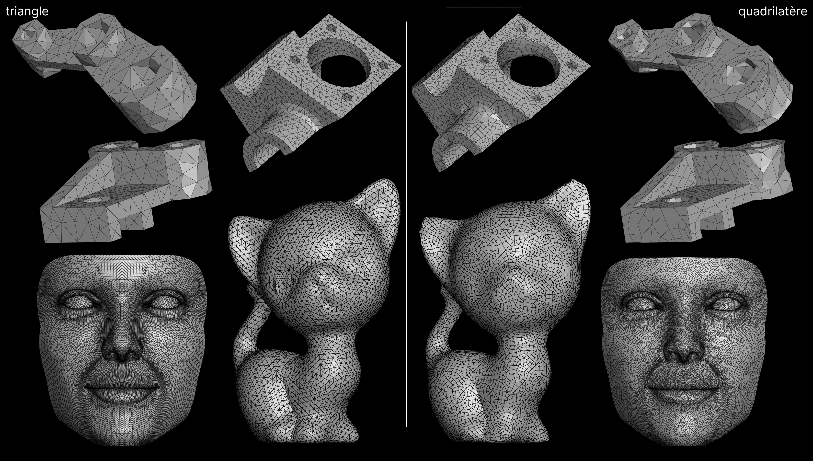

# Triangle to Quadrilateral Mesh Conversion

Result with `triToQuadSimple.cpp`

## Compile
```shell
cmake -B build -DCMAKE_BUILD_TYPE=Release
cd build
make -j
cd ..
```

or for **linux** & **mac**:
```shell
./compile.sh
```

---

## Execute
```shell
./build/entrypoint_exec

``` 
### usage:
- **entrypoint_exec** *path_mesh* *number_region*
- **entrypoint_exec** *path_mesh*
- **entrypoint_exec** *number_region*
- **entrypoint_exec**
- **entrypoint_exec** -h